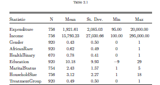
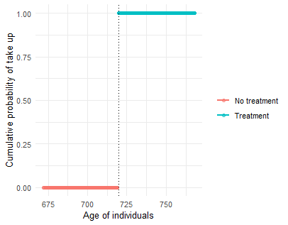
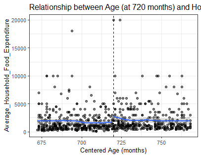
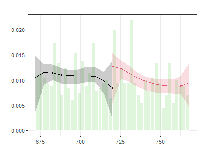
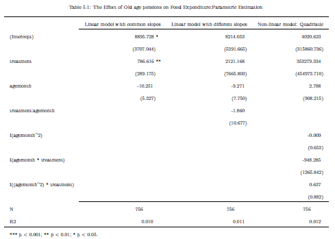
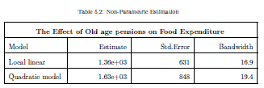
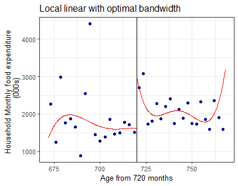
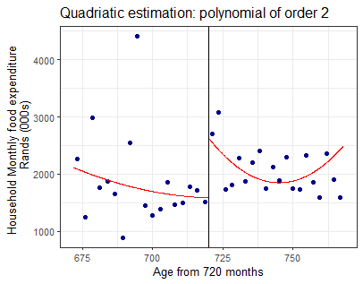
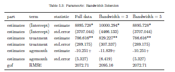
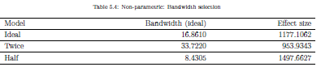

background-image: url(https://clipground.com/images/aged-person-clipart-2.jpg)

```{r setup, include=FALSE}
options(htmltools.dir.version = FALSE)
```

---
class: class, top
background-image: url(https://clipground.com/images/aged-person-clipart-2.jpg)
background-size: 100px
background-position: 98% 0%

# Introduction

## Background
* There is alot of interest on the relationship between household income and their spending patterns
* Vast literature focusing on the cash transfers abd their spillover effects eg Old age pensions allocated to women had a positive effect on the girl child (Duflo2003)
* In the study we examine the effects of a pension scheme on the monthly household expenditure on food
* We can infer causality argument since the running variable for eligibility is exogenous
---
class: class, top
background-image: url(https://clipground.com/images/aged-person-clipart-2.jpg)
background-size: 100px
background-position: 98% 0%

# Introduction
## Context
+ South African OAP is a monthly cash transfer to older adults
    + Eligibility  based on age great than or equal to 60 years
+ Eligibility used to be for males at 65yrs and females 60yrs but after 2008 they made a uniform threshold at 60 years
+ Since 2017, people above 60 years receive about R1600 per month and above 75 receive close to R2000
+ .red[Eligibility is determined by age and means test]
---
class: class, top
background-image: url(https://clipground.com/images/aged-person-clipart-2.jpg)
background-size: 100px
background-position: 98% 0%
# Introduction
## Key Empirical Strategy
+ Since age eligibility is the criteria we can rationalize the use of a Research Discontinuity Design
+ Assumption: The probability of an individual receiving the pension jumps at the age threshold of 60 years (720 months), inducing variation in treatment assignment and we assume no confounders
+ Traditionally we would assume the non-parametric identification from RDD basing on the smoothness assumption
+ Following Cattaneo et al (2015),for this study we also adopt the local randomization approach. Where ATE is in a neighborhood (window near the threshold)
+ In
this study, we posit that we would expect to find some evidence supporting that old age pension will
increase household expenditure on food, especially around the cutoff age. However, we also expect
the retirement puzzle to hold for ages further away from the threshold.
---
class: class, top
background-image: url(https://clipground.com/images/aged-person-clipart-2.jpg)
background-size: 100px
background-position: 98% 0%

# Introduction
## Contributions
+ One of the first studies to primarily investigate the effects of old age pensions on household monthly food expenditure in South Africa.
+ Studies Retirement Consumption puzzle in a developing country context  
---
class: class, top
background-image: url(https://clipground.com/images/aged-person-clipart-2.jpg)
background-size: 100px
background-position: 98% 0%
# Data
## Data and Interpretation
.pull-left[
+ We used the South African National Income Dynamics Study (NIDS) 
    + 2017, Wave 5
+ Survey involves interview questions but not information of whether the individuals receive the cash transfer or not
+ Outcome variable : Household monthly food expenditure as is 
+ Individuals spend on average **R1925** on food expenditure
+ Household compromise of about 3 family members which could affect spending patterns
]
.pull-right[


]

---
class: class, top
background-image: url(https://clipground.com/images/aged-person-clipart-2.jpg)
background-size: 100px
background-position: 98% 0%

# Data
## Data Description
.pull-left[
- `pid`: A randomly assigned person indicator in the survey
- `Household Food expenditure`: Total amount spent by the household on food expenditure monthly
- `Household Income`: Household monthly income 
- `Gender`: Binary variable indicating 1 if male and 0 if female
- `Race`: Binary variable indicating 1 if African and 0 if other race
- `Perceived health status`: Binary variable grouped into Healthy = "Excellent", "Very good", "Good" and Unhealthy = "Fair", "Poor".
]

.pull-right[
- `Highest level of Education`: Individual has none, some primary, some secondary, vs secondary or more
- `Marital Status`:Individual has never married, divorced/separated, currently married, vs widowed
- `Household Size`: Number of people in a household
- `Treatment`: Binary variable indicating if an individual was assigned to the old age pension program when they reach the age eligibility threshold  
]
---
class: class, top
background-image: url(https://clipground.com/images/aged-person-clipart-2.jpg)
background-size: 100px
background-position: 98% 0%

## Graphical and Statistical Evidence
---
class: class, top
background-image: url(https://clipground.com/images/aged-person-clipart-2.jpg)
background-size: 100px
background-position: 98% 0%

# Graphical evidence
.pull-left[### Checking for Take-up  

+ Sharp RDD
+ Assume complete take up since its survey data and we cannot infer on compliers
]
--
.pull-right[ ### Discontinuity in Outcome

+ Jump is evident at the threshold
]

---
class: class, top
background-image: url(https://clipground.com/images/aged-person-clipart-2.jpg)
background-size: 100px
background-position: 98% 0%

# Data
## Regression Specification

$$Expf= \alpha + \delta D+ \beta_{1}Age+ \beta_{2}(D*Age) + \varepsilon_i$$
* Age represents the ages in months (**60 years = 720 months**); D represents the treatment/ eligibility variable; (D*Age) interaction between Age and Treatment.
* Alternative models included :
    *  $$Expf= \alpha + \delta D+ \beta_{1}Age+ \beta_{2}(D*Age) + \beta_{3}X_{i} + \varepsilon_i$$
    * $$Expf= \alpha + \delta D+ \beta_{1}Age+ \beta_{2}(D*Age)+ \beta_{3}Age^2 +\beta_{4}(D*Age)^2 +\varepsilon_i$$

---
class:  class, top
background-image: url(https://clipground.com/images/aged-person-clipart-2.jpg)
background-size: 100px
background-position: 98% 0%
## Manipulation Test: McCrary Test

.pull-left[

]
.pull-right[
+ Test for sorting or bunching
Formal Test:  
`Ho: Continuity of density of the running variable`  
`Ha : A jump in density function at the point`
Findings :
+ Overlap of confidence intervals
+ Test statistic of *0.6043* (robust)  and p-value of *0.5456*
+ Pass the bunching test

]
---
class:  class, top
background-image: url(https://clipground.com/images/aged-person-clipart-2.jpg)
background-size: 100px
background-position: 98% 0%

# Empirical Results
## Parametric Results
.pull-left[

]

.pull-right[
+ Only slope is statistically significant 
+ We expect that individuals who
reached the age threshold of 720 months will on average spend **R786** more on food, ceteris paribus 
]  
 

---
class:  class, top
background-image: url(https://clipground.com/images/aged-person-clipart-2.jpg)
background-size: 100px
background-position: 98% 0%

# Empirical Results
## Non-Parametric Results  
.pull-left[

+ We observe discontinuity on the graph 
+ Estimate the model in a limited time frame around the cutoff 
+ Triangular Kernel function but bandwidth selection is based on data generating process
]

.pull-right[


]  
  

---
class: class, top
background-image: url(https://clipground.com/images/aged-person-clipart-2.jpg)
background-size: 100px
background-position: 98% 0%
#Specification Tests
## Robustness
*Placebo Test : Covariates on running variable* 
+ We found no discontinuities in average outcoem at other values
+ RDD parameter estimates were not sensitive to the inclusion and exclusion of covariates, with the exception of household size. 
  + Household composition could change around the cutoff age due to old age dependency. 
---
class: class, top
background-image: url(https://clipground.com/images/aged-person-clipart-2.jpg)
background-size: 100px
background-position: 98% 0%
# Specification Tests
## Robustness
*Bandwidth window selection*  
.pull-left[
+ Objective was to minimise the mean squared error between the estinates and actual treatment effect
+ We support the idea that our results are sensitive to the choice of bandwidth
+ IKbandwidth gave an optimal of approx 44months
+ Findings : Smaller bandwidth larger effects
]
.pull-right[



]
---
class: class, top
background-image: url(https://clipground.com/images/aged-person-clipart-2.jpg)
background-size: 100px
background-position: 98% 0%
# Conclusion
## Conclusion

+ We found evidence for expenditure changes on food in response to older adults receiving age-based pensions
+ The effect is very evident at the cutoff but over time the expenditure decreases at later ages
+ Triangular kernel gives more importance to observations closer to the threshold and as such bandwidth selection is important
+ Exogeneity of the age based criteria increase the probability of old individuals being eligible for pension and therefore monthly food expenditure
+ Further research could attempt studying these effects between men and women to verify Duflo's findings.

---

class: center, middle

# Thanks!

Slides created via the R package [**xaringan**](https://github.com/yihui/xaringan).

The chakra comes from [remark.js](https://remarkjs.com), [**knitr**](https://yihui.org/knitr/), and [R Markdown](https://rmarkdown.rstudio.com).
